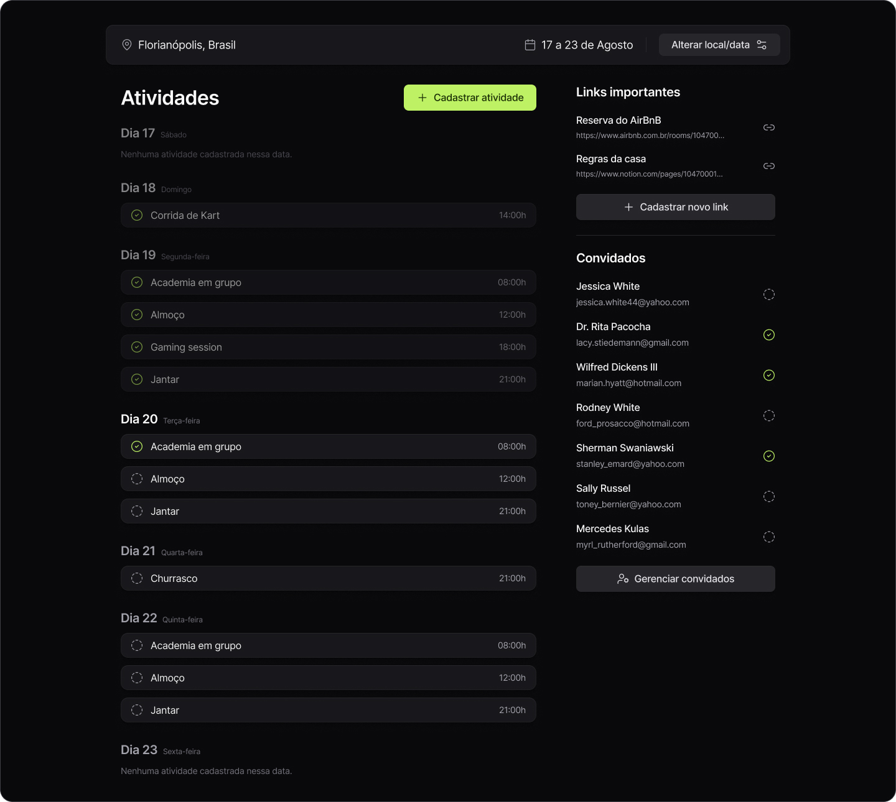

<h1 align="center">plann.er</h1>

  

  

  

  

## 🚀 Tecnologias

Esse projeto foi desenvolvido com as seguintes tecnologias:

- HTML
- CSS
- JavaScript
- React

## 💻 Projeto

Um planejador de viajens feito inteiramente com React no evento da NLW da RocketSeat!

---

Feito com ♥ by Cleber-Risu
